  

# 

  

---

### 🖥️ [SYSTEM_INFO]
*   **OPERATOR:** Archklein
*   **STATUS:** BSIT Student | Junior Executive Trainee at PCT
*   **MISSION:** Learning to build the web one line at a time.

---

### 📊 [METRICS_TRACKER]

  

---

### 🛠️ [LOADED_MODULES]

  
  
  
  

